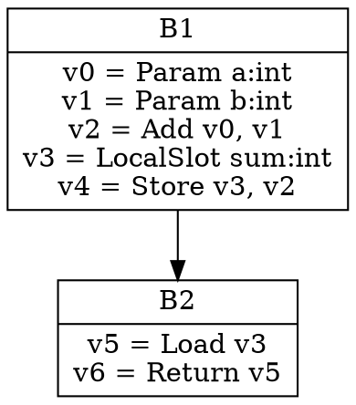

Response:
Let's break down the thought process for analyzing this Go code snippet.

**1. Understanding the Goal:**

The primary goal is to analyze a Go code snippet and explain its functionality, potentially inferring its purpose within a larger context. The request emphasizes explaining the code's role, providing usage examples (if inferrable), detailing command-line arguments (if any), and highlighting potential pitfalls.

**2. Initial Code Inspection and Keyword Identification:**

I started by reading through the code and identifying key elements:

* **`htmlFuncPrinter` struct:**  This immediately suggests the code is involved in generating HTML output, likely related to a function or a block of code.
* **Methods like `startFunction`, `endFunction`, `startBlock`, `endBlock`, `value`, `named`:** These method names strongly indicate a process of traversing and representing some kind of structured data, probably a control flow graph or intermediate representation. The "start" and "end" prefixes reinforce this idea of hierarchical structure.
* **`io.WriteString`, `fmt.Fprintf`, `fmt.Fprint`:**  These functions confirm the HTML generation aspect. They're used for writing strings to an `io.Writer`.
* **HTML tags and classes (`<ul class="...">`, `<li class="...">`, `<button>`, `<span>`):**  Further evidence of HTML generation, used for structuring and styling the output.
* **`dotWriter` struct and related functions (`newDotWriter`, `passIdxByName`):**  This section appears to deal with generating "dot" files, which are often used for visualizing graphs (control flow graphs, etc.). The `passes` variable (even though not defined in the snippet) is clearly significant here. The `mask` parameter in `newDotWriter` hints at filtering which phases to generate graphs for.
* **`exec.LookPath("dot")`:** This confirms the dependency on the `dot` command-line tool.
* **`passes` (mentioned but not defined):** The code clearly references a global variable `passes`. This suggests the snippet is part of a larger compilation or analysis pipeline where different "passes" or optimization stages are performed.

**3. Inferring the Context and Purpose:**

Based on the keywords and structure, I inferred the following:

* **SSA (Static Single Assignment):** The class names like `ssa-start-function`, `ssa-start-block`, `ssa-long-value` strongly suggest this code is related to representing SSA form, a common intermediate representation used in compilers.
* **Compiler Tooling:** The presence of "passes" and the generation of dot files indicate this is likely part of a compiler's internal tooling, specifically for debugging or visualizing the compilation process.
* **HTML Visualization:** The `htmlFuncPrinter` clearly aims to present the SSA representation in a human-readable HTML format.
* **Control Flow Graph (CFG) Visualization:** The `dotWriter` is responsible for generating graph descriptions of the CFG, likely for further processing by the `dot` tool to create visual representations (like SVGs).

**4. Explaining the Functionality of Each Part:**

I then systematically went through each struct and its methods to explain what they do:

* **`htmlFuncPrinter`:** Focused on its role in structuring the HTML output for a function, blocks within the function, and the values within those blocks. I noted the use of HTML elements for visual separation and potential interactivity (`<button onclick="...">`).
* **`dotWriter`:** Explained its purpose in generating dot files for specific compilation phases, highlighting the parsing of the `mask` string to select which phases to include. I emphasized the dependency on the `dot` command-line tool.

**5. Providing Examples (and Recognizing Limitations):**

* **HTML Generation:** I created a simple hypothetical Go function and showed how the `htmlFuncPrinter` methods *might* be used to generate the HTML structure. I emphasized that the actual `Block` and `Value` structs and their `HTML()` and `LongHTML()` methods are not defined in the snippet, so the example is illustrative.
* **Dot File Generation:** I explained how the `mask` parameter in `newDotWriter` works, giving examples of different mask values and their effect on which phases would have dot files generated.

**6. Identifying Potential Pitfalls:**

I considered common mistakes users might make:

* **Invalid `mask` format for `dotWriter`:**  I pointed out the specific syntax for the mask and gave examples of incorrect usage.
* **Missing `dot` command:** I highlighted the dependency on the `dot` tool and the error message that would occur if it's not installed.

**7. Addressing Command-Line Arguments:**

I specifically looked for any code that directly parsed command-line arguments. Since none was present in the snippet, I stated that the code *itself* doesn't handle command-line arguments but is likely used *by* a larger program that does. The `mask` for `dotWriter` is closer to a configuration option than a direct command-line argument in this snippet's context.

**8. Structuring the Answer:**

I organized the information into logical sections with clear headings to make it easy to understand. I used code formatting and bold text to highlight key points.

**9. Review and Refinement:**

I reread my analysis to ensure accuracy, clarity, and completeness, checking if I had addressed all aspects of the original request. I paid attention to the prompt's request to "归纳一下它的功能" (summarize its function) for the second part of the question.

**Self-Correction/Refinement during the process:**

* **Initial thought:** Maybe the HTML generation is for a web-based debugger?
* **Correction:**  While possible, the context of "passes" and SSA strongly suggests this is an internal compiler tool, likely for offline analysis or debugging.
* **Initial thought:** The `mask` is a simple string.
* **Refinement:** Realized the `mask` has a specific syntax for ranges and comma-separated values, requiring more detailed explanation.
* **Realization:**  The example Go code showing usage of `htmlFuncPrinter` is highly speculative since the `Block` and `Value` types aren't defined. I made sure to highlight this limitation.

By following this structured thought process, I could analyze the code effectively, infer its purpose, and provide a comprehensive explanation according to the prompt's requirements.
好的，我们来归纳一下这段Go代码的功能。

这段代码是Go编译器中 `ssa` 包的一部分，专门负责将SSA（Static Single Assignment，静态单赋值）形式的中间表示（IR）以HTML格式输出，用于开发者查看和调试。  同时，它也负责生成 `dot` 格式的文件，用于可视化控制流图（CFG）。

**主要功能归纳：**

1. **SSA到HTML的转换:**  `htmlFuncPrinter` 结构体及其相关方法（如 `startFunction`, `endFunction`, `startBlock`, `endBlock`, `value`, `named`）的主要功能是将SSA形式的函数、基本块、以及值（Values）转换成易于阅读的HTML格式。
    * 它会生成带有CSS类名的HTML元素，用于结构化显示函数和基本块的层次关系。
    * 它会显示基本块的ID、前驱基本块、以及包含的值。
    * 它可以折叠/展开基本块中的值列表（通过生成带有 `onclick` 事件的按钮）。
    * 它会标记已经失效的值（`dead-value`）。
    * 它可以标记依赖循环（`depcycle`）。
    * 它还可以显示局部变量的名字及其关联的值。

2. **控制流图（CFG）到Dot文件的生成:** `dotWriter` 结构体及其相关方法（`newDotWriter`）负责生成Graphviz的 `dot` 格式文件，用于可视化函数的控制流图。
    * 它允许用户通过一个 `mask` 字符串来指定要生成CFG的编译阶段（passes）。
    * 它依赖于系统中安装了 `dot` 命令行工具。

**与Go语言功能的关联推断：**

这段代码是Go编译器内部用于调试和可视化SSA中间表示的工具，开发者可以通过在编译时设置特定的标志来启用这些输出。这对于理解编译器的优化过程和代码的转换非常有帮助。

**代码举例说明（基于推断）：**

假设我们有一个简单的Go函数：

```go
package main

func add(a int, b int) int {
	sum := a + b
	return sum
}

func main() {
	result := add(10, 5)
	println(result)
}
```

当使用Go编译器并开启生成SSA HTML的功能时（这通常需要特定的编译选项，不在本代码片段中体现），`htmlFuncPrinter` 可能会生成类似以下的HTML结构来表示 `add` 函数：

```html
<li class="ssa-start-function">
  Function: add
  <ul>
    <li class="ssa-start-block">Block 1: &#8592; </li>
    <li class="ssa-value-list">
      <ul>
        <li class="ssa-long-value ">v0 = Param a:int</li>
        <li class="ssa-long-value ">v1 = Param b:int</li>
        <li class="ssa-long-value ">v2 = Add <input type=text class=arg value="v0">, <input type=text class=arg value="v1"></li>
        <li class="ssa-long-value ">v3 = LocalSlot sum:int</li>
        <li class="ssa-long-value ">v4 = Store <input type=text class=arg value="v3">, <input type=text class=arg value="v2"></li>
      </ul>
    </li>
    <li class="ssa-end-block">B1: ← </li>
    <li class="ssa-start-block">Block 2: &#8592; Block 1<button onclick="hideBlock(this)">-</button></li>
    <li class="ssa-value-list">
      <ul>
        <li class="ssa-long-value ">v5 = Load <input type=text class=arg value="v3"></li>
        <li class="ssa-long-value ">v6 = Return <input type=text class=arg value="v5"></li>
      </ul>
    </li>
    <li class="ssa-end-block">B2: from B1</li>
  </ul>
</li>
```

**假设的输入与输出（dotWriter）：**

假设编译过程中有一个名为 "opt" 的优化阶段。如果 `dotWriter` 的 `mask` 设置为 `"opt"`, 那么它会尝试生成一个名为类似 `函数名.opt.dot` 的文件，其中包含该函数在 "opt" 阶段的控制流图描述。 文件内容可能如下：



然后，可以使用 `dot` 命令将此文件转换为图片：

```bash
dot add.opt.dot -Tsvg -o add.opt.svg
```

**命令行参数的具体处理（dotWriter）：**

`dotWriter` 的 `newDotWriter` 函数接收一个 `mask` 字符串作为参数，用于指定生成dot文件的编译阶段。

* `"*"`:  表示生成所有编译阶段的dot文件。
* `"x-y"`: 表示生成从第 x 个阶段到第 y 个阶段（包含 x 和 y）的dot文件，这里的 x 和 y 是编译阶段的名称。
* `"x,y"`: 表示只生成第 x 个和第 y 个阶段的dot文件。

例如：

* `newDotWriter("*")`:  会尝试为所有编译阶段生成dot文件。
* `newDotWriter("generic-opt-loop,ssa")`:  只会为 "generic-opt-loop" 和 "ssa" 这两个阶段生成dot文件。
* `newDotWriter("inline-loop")`: 只会为 "inline-loop" 阶段生成dot文件。
* `newDotWriter("generic-opt-loop-ssa")`: 会被解释为从 "generic-opt-loop" 到 "ssa" 阶段（包含这两个阶段）。  注意，这里使用了下划线代替空格。

**总结 `html.go` (第2部分) 的功能：**

这段代码的第二部分主要负责以下功能：

* **完成基本块的HTML输出：** `endBlock` 方法输出基本块的结束标签，并包含基本块的详细信息（通过 `b.LongHTML()`）。
* **输出值的HTML表示：** `value` 方法将单个SSA值转换成HTML，并可以标记已失效的值。
* **标记依赖循环：** `startDepCycle` 和 `endDepCycle` 方法用于在HTML输出中标记可能存在的依赖循环。
* **输出命名局部变量的信息：** `named` 方法显示局部变量的名字以及与之关联的SSA值。
* **实现Dot文件生成器：**  `dotWriter` 结构体及其 `newDotWriter` 函数实现了根据指定的编译阶段生成Graphviz Dot文件的功能，用于可视化控制流图。

总的来说，这段代码是Go编译器中用于生成SSA中间表示和控制流图的HTML及Dot文件表示的核心部分，主要用于编译器的内部调试和可视化。 它允许开发者更深入地理解编译器的优化和转换过程。

Prompt: 
```
这是路径为go/src/cmd/compile/internal/ssa/html.go的go语言实现的一部分， 请列举一下它的功能, 　
如果你能推理出它是什么go语言功能的实现，请用go代码举例说明, 
如果涉及代码推理，需要带上假设的输入与输出，
如果涉及命令行参数的具体处理，请详细介绍一下，
如果有哪些使用者易犯错的点，请举例说明，没有则不必说明，
请用中文回答。
这是第2部分，共2部分，请归纳一下它的功能

"""
ass=\"ssa-start-block\">%s:", b.HTML())
	if len(b.Preds) > 0 {
		io.WriteString(p.w, " &#8592;") // left arrow
		for _, e := range b.Preds {
			pred := e.b
			fmt.Fprintf(p.w, " %s", pred.HTML())
		}
	}
	if len(b.Values) > 0 {
		io.WriteString(p.w, `<button onclick="hideBlock(this)">-</button>`)
	}
	io.WriteString(p.w, "</li>")
	if len(b.Values) > 0 { // start list of values
		io.WriteString(p.w, "<li class=\"ssa-value-list\">")
		io.WriteString(p.w, "<ul>")
	}
}

func (p htmlFuncPrinter) endBlock(b *Block, reachable bool) {
	if len(b.Values) > 0 { // end list of values
		io.WriteString(p.w, "</ul>")
		io.WriteString(p.w, "</li>")
	}
	io.WriteString(p.w, "<li class=\"ssa-end-block\">")
	fmt.Fprint(p.w, b.LongHTML())
	io.WriteString(p.w, "</li>")
	io.WriteString(p.w, "</ul>")
}

func (p htmlFuncPrinter) value(v *Value, live bool) {
	var dead string
	if !live {
		dead = "dead-value"
	}
	fmt.Fprintf(p.w, "<li class=\"ssa-long-value %s\">", dead)
	fmt.Fprint(p.w, v.LongHTML())
	io.WriteString(p.w, "</li>")
}

func (p htmlFuncPrinter) startDepCycle() {
	fmt.Fprintln(p.w, "<span class=\"depcycle\">")
}

func (p htmlFuncPrinter) endDepCycle() {
	fmt.Fprintln(p.w, "</span>")
}

func (p htmlFuncPrinter) named(n LocalSlot, vals []*Value) {
	fmt.Fprintf(p.w, "<li>name %s: ", n)
	for _, val := range vals {
		fmt.Fprintf(p.w, "%s ", val.HTML())
	}
	fmt.Fprintf(p.w, "</li>")
}

type dotWriter struct {
	path   string
	broken bool
	phases map[string]bool // keys specify phases with CFGs
}

// newDotWriter returns non-nil value when mask is valid.
// dotWriter will generate SVGs only for the phases specified in the mask.
// mask can contain following patterns and combinations of them:
// *   - all of them;
// x-y - x through y, inclusive;
// x,y - x and y, but not the passes between.
func newDotWriter(mask string) *dotWriter {
	if mask == "" {
		return nil
	}
	// User can specify phase name with _ instead of spaces.
	mask = strings.Replace(mask, "_", " ", -1)
	ph := make(map[string]bool)
	ranges := strings.Split(mask, ",")
	for _, r := range ranges {
		spl := strings.Split(r, "-")
		if len(spl) > 2 {
			fmt.Printf("range is not valid: %v\n", mask)
			return nil
		}
		var first, last int
		if mask == "*" {
			first = 0
			last = len(passes) - 1
		} else {
			first = passIdxByName(spl[0])
			last = passIdxByName(spl[len(spl)-1])
		}
		if first < 0 || last < 0 || first > last {
			fmt.Printf("range is not valid: %v\n", r)
			return nil
		}
		for p := first; p <= last; p++ {
			ph[passes[p].name] = true
		}
	}

	path, err := exec.LookPath("dot")
	if err != nil {
		fmt.Println(err)
		return nil
	}
	return &dotWriter{path: path, phases: ph}
}

func passIdxByName(name string) int {
	for i, p := range passes {
		if p.name == name {
			return i
		}
	}
	return -1
}

"""


```