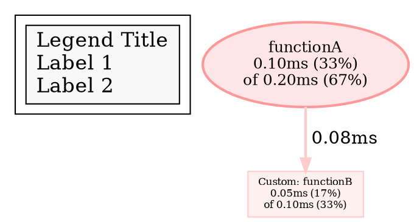

Response:
Let's break down the thought process for analyzing the provided Go code snippet.

**1. Understanding the Goal:**

The request asks for the functionality of the `dotgraph.go` file, specifically within the context of generating DOT language descriptions of graphs. It also requires providing Go code examples, reasoning about the implementation, and highlighting potential pitfalls for users.

**2. Initial Code Scan and Identifying Key Structures:**

My first step is to quickly scan the code and identify the major data structures and functions. I notice:

* **Packages and Imports:** The `graph` package and imports like `fmt`, `io`, `math`, `path/filepath`, and `strings`, along with `github.com/google/pprof/internal/measurement`. This immediately suggests that the code deals with graph representation and output formatting, possibly related to performance profiling (`pprof`).
* **`DotAttributes` and `DotNodeAttributes`:** These structs clearly define attributes related to the visual representation of nodes in the graph. Keywords like "shape", "bold", "URL", and "formatter" are strong indicators of visual customization.
* **`DotConfig`:** This struct holds configuration parameters for the overall graph generation, including title, legend, and value formatting.
* **`ComposeDot` function:** This seems to be the core function for generating the DOT output. It takes an `io.Writer`, a `Graph`, `DotAttributes`, and `DotConfig` as input, strongly suggesting it's the main entry point for the DOT generation process.
* **`builder` struct:** This struct encapsulates the `io.Writer` and configuration, likely used to manage the DOT output construction process. Methods like `start`, `finish`, `addLegend`, `addNode`, and `addEdge` confirm this.
* **Helper Functions:**  Functions like `dotColor`, `multilinePrintableName`, `collapsedTags`, `escapeForDot` suggest utility functions for specific DOT formatting tasks.

**3. Deeper Dive into `ComposeDot`:**

The `ComposeDot` function is central, so I'll analyze its steps:

* **Initialization:** Creates a `builder`.
* **Starting the DOT graph:** Calls `builder.start()`, which likely writes the `digraph` header.
* **Adding the legend:** Calls `builder.addLegend()`, handling the display of labels.
* **Handling empty graphs:** Returns early if there are no nodes.
* **Preprocessing:** Creates `nodeIDMap` and calculates `maxFlat`, hinting at internal bookkeeping and normalization.
* **Iterating through nodes:** Loops through the graph's nodes and calls `builder.addNode` and `builder.addNodelets`. This confirms the individual node rendering logic.
* **Collecting edges:**  Iterates through the outgoing edges of each node.
* **Adding edges:** Calls `builder.addEdge` to generate the edge definitions in DOT.

**4. Understanding the `builder` Methods:**

Now, I examine the methods of the `builder` struct:

* **`start` and `finish`:**  Basic DOT graph opening and closing.
* **`addLegend`:**  Generates the DOT subgraph for the legend, including labels, URL, and tooltip.
* **`addNode`:**  Formats the node label, calculates font size based on `maxFlat`, determines the node shape, and constructs the DOT node attribute string. It also handles custom formatters from `DotNodeAttributes`.
* **`addNodelets` and `numericNodelets`:**  Handles the display of "nodelets" which appear to be additional labels associated with a node, especially for tags (both label and numeric). This seems like a way to provide more granular information on a node without cluttering the main label.
* **`addEdge`:**  Formats the edge label, weight, penwidth, color, and tooltip. It also considers whether the edge is inline or residual.

**5. Inferring Functionality and Potential Use Cases:**

Based on the identified structures and functions, I can infer the core functionality:

* **Generating DOT language descriptions of graphs:** This is the primary purpose.
* **Customizing node appearance:**  `DotAttributes` and `DotNodeAttributes` allow control over shape, boldness, borders, URLs, and custom label formatting.
* **Providing graph-level configuration:** `DotConfig` enables setting the title, legend, and custom value formatting.
* **Visualizing performance profiles:** The package path (`pprof`) and the use of terms like "flat value" and "cumulative value" strongly suggest that this code is used to visualize performance profiles generated by `pprof`. The "nodelets" likely represent tag information within the profile.

**6. Crafting Go Code Examples:**

Now, I can construct Go code examples to illustrate the usage. I need to demonstrate:

* Basic graph creation and `ComposeDot` usage.
* Customizing node attributes.
* Using `DotConfig` for title and legend.

**7. Reasoning About Implementation Details:**

I need to explain *why* certain things are done:

* **Scaling font size:** To visually emphasize more important nodes.
* **Nodelets:** To display additional information without making the main node label too long.
* **Edge attributes (weight, penwidth, color):** To visually represent the significance of connections.
* **`escapeForDot`:** Because DOT has specific syntax requirements for special characters.

**8. Identifying Potential Pitfalls:**

I need to think about common mistakes users might make:

* **Incorrectly escaping strings:** Leading to parsing errors in Graphviz.
* **Overly complex custom formatters:** Making the graph difficult to read.
* **Misunderstanding how nodelets are positioned:**  Their relationship to the main node might not be immediately obvious.

**9. Structuring the Answer:**

Finally, I need to organize the information in a clear and structured way, using headings and bullet points as requested. This involves:

* Clearly stating the main functionality.
* Providing well-commented Go code examples.
* Explaining the code's reasoning.
* Detailing command-line argument handling (although the provided snippet doesn't directly handle them, it's important to acknowledge how this *might* be used in a larger context).
* Highlighting potential pitfalls.

By following this detailed thought process, I can systematically analyze the code, understand its purpose, and generate a comprehensive and accurate answer to the user's request. The key is to break down the problem into smaller, manageable parts and then synthesize the findings into a cohesive explanation.
这段代码是 Go 语言实现的 `pprof` 工具中，用于将性能分析图数据转换为 DOT 格式的逻辑。DOT 是一种文本描述语言，常用于生成图形，特别是图结构。`pprof` 使用 DOT 格式可以方便地生成火焰图、调用图等可视化表示，帮助开发者分析程序的性能瓶颈。

**主要功能:**

1. **定义 DOT 图的结构:** 定义了 `DotAttributes` 和 `DotNodeAttributes` 结构体，用于存储节点的视觉属性（例如形状、是否加粗、边框数量、URL 链接、标签格式化器）。`DotConfig` 结构体则存储了整个 DOT 图的配置信息（例如标题、图例 URL、图例标签、数值格式化函数、总权重）。

2. **生成 DOT 格式的文本:**  `ComposeDot` 函数是核心，它接收一个 `io.Writer` 用于输出 DOT 文本，一个表示图数据的 `Graph` 对象，以及 `DotAttributes` 和 `DotConfig` 对象作为配置。它遍历图中的节点和边，并将它们转换为 DOT 语言的节点和边的描述。

3. **自定义节点和边的外观:** 通过 `DotAttributes` 和 `DotNodeAttributes`，可以灵活地控制每个节点的显示效果，例如：
    * `Shape`:  设置节点的形状 (例如 "box", "ellipse", "circle")。
    * `Bold`:  设置节点文字是否加粗。
    * `Peripheries`: 设置节点边框的数量。
    * `URL`:  为节点添加点击链接。
    * `Formatter`:  自定义节点标签的显示格式。

4. **添加图例:** `addLegend` 函数根据 `DotConfig` 中的 `Labels` 和 `LegendURL` 生成 DOT 图的图例部分。

5. **缩放节点字体大小:** `addNode` 函数会根据节点的 `FlatValue` (平坦值，通常表示函数自身的执行耗时) 占总权重的比例来动态调整节点的字体大小，使得耗时越长的节点在图中显得更大。

6. **显示节点标签信息 (nodelets):** `addNodelets` 和 `numericNodelets` 函数用于在节点下方或旁边添加额外的标签信息，通常用于展示与该节点相关的标签数据（例如内存分配大小、锁持有时间等）。这些标签可以帮助更细粒度地分析性能。

7. **自定义数值显示格式:** `DotConfig` 中的 `FormatValue` 函数允许用户自定义数值的显示格式，例如添加单位、精度控制等。

8. **控制边的显示效果:** `addEdge` 函数会根据边的权重值来调整边的粗细和颜色，权重越大的边通常会更粗更明显。还可以设置边的箭头类型 (例如普通箭头 `->` 或虚线箭头 `...`)。

9. **转义特殊字符:** `escapeForDot` 函数用于转义 DOT 语言中的特殊字符，例如双引号和反斜杠，以确保生成的 DOT 文本符合语法规范。

**它是什么 Go 语言功能的实现:**

这段代码主要实现了 **结构体 (struct)**、**方法 (method)**、**接口 (interface - `io.Writer`)**、**函数 (function)** 以及一些常用的 Go 语言特性，例如 **切片 (slice)**、**映射 (map)**。

**Go 代码举例说明:**

假设我们已经有了一个 `Graph` 对象 `myGraph`，并且我们想生成一个包含自定义节点属性和图例的 DOT 图。

```go
package main

import (
	"fmt"
	"os"

	"github.com/google/pprof/internal/graph"
	"github.com/google/pprof/internal/measurement"
)

func main() {
	// 假设 myGraph 已经通过某种方式创建并填充了数据
	myGraph := &graph.Graph{
		Nodes: []*graph.Node{
			{Info: graph.NodeInfo{Name: "functionA"}, Flat: 100, Cum: 200},
			{Info: graph.NodeInfo{Name: "functionB"}, Flat: 50, Cum: 100},
		},
		// ... 其他节点和边
	}

	dotAttributes := &graph.DotAttributes{
		Nodes: map[*graph.Node]*graph.DotNodeAttributes{
			myGraph.Nodes[0]: {Shape: "ellipse", Bold: true, URL: "http://example.com/functionA"},
			myGraph.Nodes[1]: {Shape: "box", Formatter: func(info *graph.NodeInfo) string {
				return fmt.Sprintf("Custom: %s", info.Name)
			}},
		},
	}

	dotConfig := &graph.DotConfig{
		Title:     "My Performance Profile",
		LegendURL: "http://example.com/legend",
		Labels:    []string{"Legend Title", "Label 1", "Label 2"},
		FormatValue: func(v int64) string {
			return fmt.Sprintf("%.2fms", float64(v)/1000.0) // 假设单位是纳秒，转换为毫秒
		},
		Total: 300, // 假设总权重为 300
	}

	// 将 DOT 输出到标准输出
	graph.ComposeDot(os.Stdout, myGraph, dotAttributes, dotConfig)
}
```

**假设的输入与输出:**

**假设的 `myGraph` 数据 (简化版):**

```go
myGraph := &graph.Graph{
	Nodes: []*graph.Node{
		{Info: graph.NodeInfo{Name: "functionA"}, Flat: 100, Cum: 200},
		{Info: graph.NodeInfo{Name: "functionB"}, Flat: 50, Cum: 100},
	},
	Edges: []*graph.Edge{
		{Src: myGraph.Nodes[0], Dest: myGraph.Nodes[1], Weight: 80},
	},
}
```

**可能的 DOT 输出 (简化版):**



**命令行参数的具体处理:**

这段代码本身**不直接处理命令行参数**。它是一个内部模块，负责将已经构建好的图数据转换为 DOT 格式。 `pprof` 工具的命令行参数解析通常在更上层的代码中完成，例如 `cmd/pprof/main.go` 或相关的子命令处理逻辑中。

命令行参数可能会影响 `ComposeDot` 函数的输入，例如：

* **选择不同的输出格式:** 用户可能通过命令行参数选择输出为 DOT 格式。
* **过滤节点或边:**  命令行参数可能允许用户根据某些条件过滤要显示的节点或边，从而影响传递给 `ComposeDot` 的 `Graph` 对象。
* **自定义显示选项:**  更复杂的 `pprof` 版本可能会提供命令行参数来直接控制 `DotAttributes` 和 `DotConfig` 的某些属性，例如设置默认的节点形状或颜色。

**使用者易犯错的点:**

1. **不正确的字符串转义:**  在 `DotNodeAttributes` 的 `Formatter` 函数中自定义标签时，如果返回的字符串包含 DOT 语言的特殊字符（如双引号），需要使用 `escapeForDot` 函数进行转义，否则生成的 DOT 文件可能无法被 Graphviz 正确解析。

   **错误示例:**

   ```go
   dotAttributes := &graph.DotAttributes{
       Nodes: map[*graph.Node]*graph.DotNodeAttributes{
           myGraph.Nodes[0]: {Formatter: func(info *graph.NodeInfo) string {
               return fmt.Sprintf("Name: \"%s\"", info.Name) // 缺少转义
           }},
       },
   }
   ```

   **正确示例:**

   ```go
   dotAttributes := &graph.DotAttributes{
       Nodes: map[*graph.Node]*graph.DotNodeAttributes{
           myGraph.Nodes[0]: {Formatter: func(info *graph.NodeInfo) string {
               return fmt.Sprintf("Name: \"%s\"", graph.EscapeForDot(info.Name))
           }},
       },
   }
   ```

2. **自定义 `FormatValue` 函数导致不一致:**  如果自定义的 `FormatValue` 函数生成的字符串与 `pprof` 工具的其他部分（例如命令行输出）使用的格式不一致，可能会导致用户理解上的困惑。建议保持一致的格式化风格。

3. **`Total` 值的设置不正确:** `DotConfig` 中的 `Total` 值用于计算节点的百分比。如果这个值设置不正确，会导致节点标签上显示的百分比不准确，影响对性能数据的判断。需要确保 `Total` 值反映了图中所有节点的总权重。

4. **对 `maxNodelets` 的误解:** `maxNodelets` 常量限制了每个节点显示的标签数量。如果某个节点关联了大量的标签，超出 `maxNodelets` 的部分将不会显示，这可能会导致用户错过一些重要的性能信息。理解这个限制有助于用户进行更精细的分析。

总而言之，这段代码是 `pprof` 工具中生成 DOT 图的关键部分，通过灵活的配置选项，可以创建出各种定制化的性能分析图，帮助开发者深入理解程序的性能特征。理解其功能和使用方式对于有效地利用 `pprof` 进行性能分析至关重要。

Prompt: 
```
这是路径为go/src/cmd/vendor/github.com/google/pprof/internal/graph/dotgraph.go的go语言实现的一部分， 请列举一下它的功能, 　
如果你能推理出它是什么go语言功能的实现，请用go代码举例说明, 
如果涉及代码推理，需要带上假设的输入与输出，
如果涉及命令行参数的具体处理，请详细介绍一下，
如果有哪些使用者易犯错的点，请举例说明，没有则不必说明，
请用中文回答。

"""
// Copyright 2014 Google Inc. All Rights Reserved.
//
// Licensed under the Apache License, Version 2.0 (the "License");
// you may not use this file except in compliance with the License.
// You may obtain a copy of the License at
//
//     http://www.apache.org/licenses/LICENSE-2.0
//
// Unless required by applicable law or agreed to in writing, software
// distributed under the License is distributed on an "AS IS" BASIS,
// WITHOUT WARRANTIES OR CONDITIONS OF ANY KIND, either express or implied.
// See the License for the specific language governing permissions and
// limitations under the License.

package graph

import (
	"fmt"
	"io"
	"math"
	"path/filepath"
	"strings"

	"github.com/google/pprof/internal/measurement"
)

// DotAttributes contains details about the graph itself, giving
// insight into how its elements should be rendered.
type DotAttributes struct {
	Nodes map[*Node]*DotNodeAttributes // A map allowing each Node to have its own visualization option
}

// DotNodeAttributes contains Node specific visualization options.
type DotNodeAttributes struct {
	Shape       string                 // The optional shape of the node when rendered visually
	Bold        bool                   // If the node should be bold or not
	Peripheries int                    // An optional number of borders to place around a node
	URL         string                 // An optional url link to add to a node
	Formatter   func(*NodeInfo) string // An optional formatter for the node's label
}

// DotConfig contains attributes about how a graph should be
// constructed and how it should look.
type DotConfig struct {
	Title     string   // The title of the DOT graph
	LegendURL string   // The URL to link to from the legend.
	Labels    []string // The labels for the DOT's legend

	FormatValue func(int64) string // A formatting function for values
	Total       int64              // The total weight of the graph, used to compute percentages
}

const maxNodelets = 4 // Number of nodelets for labels (both numeric and non)

// ComposeDot creates and writes a in the DOT format to the writer, using
// the configurations given.
func ComposeDot(w io.Writer, g *Graph, a *DotAttributes, c *DotConfig) {
	builder := &builder{w, a, c}

	// Begin constructing DOT by adding a title and legend.
	builder.start()
	defer builder.finish()
	builder.addLegend()

	if len(g.Nodes) == 0 {
		return
	}

	// Preprocess graph to get id map and find max flat.
	nodeIDMap := make(map[*Node]int)
	hasNodelets := make(map[*Node]bool)

	maxFlat := float64(abs64(g.Nodes[0].FlatValue()))
	for i, n := range g.Nodes {
		nodeIDMap[n] = i + 1
		if float64(abs64(n.FlatValue())) > maxFlat {
			maxFlat = float64(abs64(n.FlatValue()))
		}
	}

	edges := EdgeMap{}

	// Add nodes and nodelets to DOT builder.
	for _, n := range g.Nodes {
		builder.addNode(n, nodeIDMap[n], maxFlat)
		hasNodelets[n] = builder.addNodelets(n, nodeIDMap[n])

		// Collect all edges. Use a fake node to support multiple incoming edges.
		for _, e := range n.Out {
			edges[&Node{}] = e
		}
	}

	// Add edges to DOT builder. Sort edges by frequency as a hint to the graph layout engine.
	for _, e := range edges.Sort() {
		builder.addEdge(e, nodeIDMap[e.Src], nodeIDMap[e.Dest], hasNodelets[e.Src])
	}
}

// builder wraps an io.Writer and understands how to compose DOT formatted elements.
type builder struct {
	io.Writer
	attributes *DotAttributes
	config     *DotConfig
}

// start generates a title and initial node in DOT format.
func (b *builder) start() {
	graphname := "unnamed"
	if b.config.Title != "" {
		graphname = b.config.Title
	}
	fmt.Fprintln(b, `digraph "`+graphname+`" {`)
	fmt.Fprintln(b, `node [style=filled fillcolor="#f8f8f8"]`)
}

// finish closes the opening curly bracket in the constructed DOT buffer.
func (b *builder) finish() {
	fmt.Fprintln(b, "}")
}

// addLegend generates a legend in DOT format.
func (b *builder) addLegend() {
	labels := b.config.Labels
	if len(labels) == 0 {
		return
	}
	title := labels[0]
	fmt.Fprintf(b, `subgraph cluster_L { "%s" [shape=box fontsize=16`, escapeForDot(title))
	fmt.Fprintf(b, ` label="%s\l"`, strings.Join(escapeAllForDot(labels), `\l`))
	if b.config.LegendURL != "" {
		fmt.Fprintf(b, ` URL="%s" target="_blank"`, b.config.LegendURL)
	}
	if b.config.Title != "" {
		fmt.Fprintf(b, ` tooltip="%s"`, b.config.Title)
	}
	fmt.Fprintf(b, "] }\n")
}

// addNode generates a graph node in DOT format.
func (b *builder) addNode(node *Node, nodeID int, maxFlat float64) {
	flat, cum := node.FlatValue(), node.CumValue()
	attrs := b.attributes.Nodes[node]

	// Populate label for node.
	var label string
	if attrs != nil && attrs.Formatter != nil {
		label = attrs.Formatter(&node.Info)
	} else {
		label = multilinePrintableName(&node.Info)
	}

	flatValue := b.config.FormatValue(flat)
	if flat != 0 {
		label = label + fmt.Sprintf(`%s (%s)`,
			flatValue,
			strings.TrimSpace(measurement.Percentage(flat, b.config.Total)))
	} else {
		label = label + "0"
	}
	cumValue := flatValue
	if cum != flat {
		if flat != 0 {
			label = label + `\n`
		} else {
			label = label + " "
		}
		cumValue = b.config.FormatValue(cum)
		label = label + fmt.Sprintf(`of %s (%s)`,
			cumValue,
			strings.TrimSpace(measurement.Percentage(cum, b.config.Total)))
	}

	// Scale font sizes from 8 to 24 based on percentage of flat frequency.
	// Use non linear growth to emphasize the size difference.
	baseFontSize, maxFontGrowth := 8, 16.0
	fontSize := baseFontSize
	if maxFlat != 0 && flat != 0 && float64(abs64(flat)) <= maxFlat {
		fontSize += int(math.Ceil(maxFontGrowth * math.Sqrt(float64(abs64(flat))/maxFlat)))
	}

	// Determine node shape.
	shape := "box"
	if attrs != nil && attrs.Shape != "" {
		shape = attrs.Shape
	}

	// Create DOT attribute for node.
	attr := fmt.Sprintf(`label="%s" id="node%d" fontsize=%d shape=%s tooltip="%s (%s)" color="%s" fillcolor="%s"`,
		label, nodeID, fontSize, shape, escapeForDot(node.Info.PrintableName()), cumValue,
		dotColor(float64(node.CumValue())/float64(abs64(b.config.Total)), false),
		dotColor(float64(node.CumValue())/float64(abs64(b.config.Total)), true))

	// Add on extra attributes if provided.
	if attrs != nil {
		// Make bold if specified.
		if attrs.Bold {
			attr += ` style="bold,filled"`
		}

		// Add peripheries if specified.
		if attrs.Peripheries != 0 {
			attr += fmt.Sprintf(` peripheries=%d`, attrs.Peripheries)
		}

		// Add URL if specified. target="_blank" forces the link to open in a new tab.
		if attrs.URL != "" {
			attr += fmt.Sprintf(` URL="%s" target="_blank"`, attrs.URL)
		}
	}

	fmt.Fprintf(b, "N%d [%s]\n", nodeID, attr)
}

// addNodelets generates the DOT boxes for the node tags if they exist.
func (b *builder) addNodelets(node *Node, nodeID int) bool {
	var nodelets string

	// Populate two Tag slices, one for LabelTags and one for NumericTags.
	var ts []*Tag
	lnts := make(map[string][]*Tag)
	for _, t := range node.LabelTags {
		ts = append(ts, t)
	}
	for l, tm := range node.NumericTags {
		for _, t := range tm {
			lnts[l] = append(lnts[l], t)
		}
	}

	// For leaf nodes, print cumulative tags (includes weight from
	// children that have been deleted).
	// For internal nodes, print only flat tags.
	flatTags := len(node.Out) > 0

	// Select the top maxNodelets alphanumeric labels by weight.
	SortTags(ts, flatTags)
	if len(ts) > maxNodelets {
		ts = ts[:maxNodelets]
	}
	for i, t := range ts {
		w := t.CumValue()
		if flatTags {
			w = t.FlatValue()
		}
		if w == 0 {
			continue
		}
		weight := b.config.FormatValue(w)
		nodelets += fmt.Sprintf(`N%d_%d [label = "%s" id="N%d_%d" fontsize=8 shape=box3d tooltip="%s"]`+"\n", nodeID, i, t.Name, nodeID, i, weight)
		nodelets += fmt.Sprintf(`N%d -> N%d_%d [label=" %s" weight=100 tooltip="%s" labeltooltip="%s"]`+"\n", nodeID, nodeID, i, weight, weight, weight)
		if nts := lnts[t.Name]; nts != nil {
			nodelets += b.numericNodelets(nts, maxNodelets, flatTags, fmt.Sprintf(`N%d_%d`, nodeID, i))
		}
	}

	if nts := lnts[""]; nts != nil {
		nodelets += b.numericNodelets(nts, maxNodelets, flatTags, fmt.Sprintf(`N%d`, nodeID))
	}

	fmt.Fprint(b, nodelets)
	return nodelets != ""
}

func (b *builder) numericNodelets(nts []*Tag, maxNumNodelets int, flatTags bool, source string) string {
	nodelets := ""

	// Collapse numeric labels into maxNumNodelets buckets, of the form:
	// 1MB..2MB, 3MB..5MB, ...
	for j, t := range b.collapsedTags(nts, maxNumNodelets, flatTags) {
		w, attr := t.CumValue(), ` style="dotted"`
		if flatTags || t.FlatValue() == t.CumValue() {
			w, attr = t.FlatValue(), ""
		}
		if w != 0 {
			weight := b.config.FormatValue(w)
			nodelets += fmt.Sprintf(`N%s_%d [label = "%s" id="N%s_%d" fontsize=8 shape=box3d tooltip="%s"]`+"\n", source, j, t.Name, source, j, weight)
			nodelets += fmt.Sprintf(`%s -> N%s_%d [label=" %s" weight=100 tooltip="%s" labeltooltip="%s"%s]`+"\n", source, source, j, weight, weight, weight, attr)
		}
	}
	return nodelets
}

// addEdge generates a graph edge in DOT format.
func (b *builder) addEdge(edge *Edge, from, to int, hasNodelets bool) {
	var inline string
	if edge.Inline {
		inline = `\n (inline)`
	}
	w := b.config.FormatValue(edge.WeightValue())
	attr := fmt.Sprintf(`label=" %s%s"`, w, inline)
	if b.config.Total != 0 {
		// Note: edge.weight > b.config.Total is possible for profile diffs.
		if weight := 1 + int(min64(abs64(edge.WeightValue()*100/b.config.Total), 100)); weight > 1 {
			attr = fmt.Sprintf(`%s weight=%d`, attr, weight)
		}
		if width := 1 + int(min64(abs64(edge.WeightValue()*5/b.config.Total), 5)); width > 1 {
			attr = fmt.Sprintf(`%s penwidth=%d`, attr, width)
		}
		attr = fmt.Sprintf(`%s color="%s"`, attr,
			dotColor(float64(edge.WeightValue())/float64(abs64(b.config.Total)), false))
	}
	arrow := "->"
	if edge.Residual {
		arrow = "..."
	}
	tooltip := fmt.Sprintf(`"%s %s %s (%s)"`,
		escapeForDot(edge.Src.Info.PrintableName()), arrow,
		escapeForDot(edge.Dest.Info.PrintableName()), w)
	attr = fmt.Sprintf(`%s tooltip=%s labeltooltip=%s`, attr, tooltip, tooltip)

	if edge.Residual {
		attr = attr + ` style="dotted"`
	}

	if hasNodelets {
		// Separate children further if source has tags.
		attr = attr + " minlen=2"
	}

	fmt.Fprintf(b, "N%d -> N%d [%s]\n", from, to, attr)
}

// dotColor returns a color for the given score (between -1.0 and
// 1.0), with -1.0 colored green, 0.0 colored grey, and 1.0 colored
// red. If isBackground is true, then a light (low-saturation)
// color is returned (suitable for use as a background color);
// otherwise, a darker color is returned (suitable for use as a
// foreground color).
func dotColor(score float64, isBackground bool) string {
	// A float between 0.0 and 1.0, indicating the extent to which
	// colors should be shifted away from grey (to make positive and
	// negative values easier to distinguish, and to make more use of
	// the color range.)
	const shift = 0.7

	// Saturation and value (in hsv colorspace) for background colors.
	const bgSaturation = 0.1
	const bgValue = 0.93

	// Saturation and value (in hsv colorspace) for foreground colors.
	const fgSaturation = 1.0
	const fgValue = 0.7

	// Choose saturation and value based on isBackground.
	var saturation float64
	var value float64
	if isBackground {
		saturation = bgSaturation
		value = bgValue
	} else {
		saturation = fgSaturation
		value = fgValue
	}

	// Limit the score values to the range [-1.0, 1.0].
	score = math.Max(-1.0, math.Min(1.0, score))

	// Reduce saturation near score=0 (so it is colored grey, rather than yellow).
	if math.Abs(score) < 0.2 {
		saturation *= math.Abs(score) / 0.2
	}

	// Apply 'shift' to move scores away from 0.0 (grey).
	if score > 0.0 {
		score = math.Pow(score, (1.0 - shift))
	}
	if score < 0.0 {
		score = -math.Pow(-score, (1.0 - shift))
	}

	var r, g, b float64 // red, green, blue
	if score < 0.0 {
		g = value
		r = value * (1 + saturation*score)
	} else {
		r = value
		g = value * (1 - saturation*score)
	}
	b = value * (1 - saturation)
	return fmt.Sprintf("#%02x%02x%02x", uint8(r*255.0), uint8(g*255.0), uint8(b*255.0))
}

func multilinePrintableName(info *NodeInfo) string {
	infoCopy := *info
	infoCopy.Name = escapeForDot(ShortenFunctionName(infoCopy.Name))
	infoCopy.Name = strings.Replace(infoCopy.Name, "::", `\n`, -1)
	// Go type parameters are reported as "[...]" by Go pprof profiles.
	// Keep this ellipsis rather than replacing with newlines below.
	infoCopy.Name = strings.Replace(infoCopy.Name, "[...]", "[…]", -1)
	infoCopy.Name = strings.Replace(infoCopy.Name, ".", `\n`, -1)
	if infoCopy.File != "" {
		infoCopy.File = filepath.Base(infoCopy.File)
	}
	return strings.Join(infoCopy.NameComponents(), `\n`) + `\n`
}

// collapsedTags trims and sorts a slice of tags.
func (b *builder) collapsedTags(ts []*Tag, count int, flatTags bool) []*Tag {
	ts = SortTags(ts, flatTags)
	if len(ts) <= count {
		return ts
	}

	tagGroups := make([][]*Tag, count)
	for i, t := range (ts)[:count] {
		tagGroups[i] = []*Tag{t}
	}
	for _, t := range (ts)[count:] {
		g, d := 0, tagDistance(t, tagGroups[0][0])
		for i := 1; i < count; i++ {
			if nd := tagDistance(t, tagGroups[i][0]); nd < d {
				g, d = i, nd
			}
		}
		tagGroups[g] = append(tagGroups[g], t)
	}

	var nts []*Tag
	for _, g := range tagGroups {
		l, w, c := b.tagGroupLabel(g)
		nts = append(nts, &Tag{
			Name: l,
			Flat: w,
			Cum:  c,
		})
	}
	return SortTags(nts, flatTags)
}

func tagDistance(t, u *Tag) float64 {
	v, _ := measurement.Scale(u.Value, u.Unit, t.Unit)
	if v < float64(t.Value) {
		return float64(t.Value) - v
	}
	return v - float64(t.Value)
}

func (b *builder) tagGroupLabel(g []*Tag) (label string, flat, cum int64) {
	if len(g) == 1 {
		t := g[0]
		return measurement.Label(t.Value, t.Unit), t.FlatValue(), t.CumValue()
	}
	min := g[0]
	max := g[0]
	df, f := min.FlatDiv, min.Flat
	dc, c := min.CumDiv, min.Cum
	for _, t := range g[1:] {
		if v, _ := measurement.Scale(t.Value, t.Unit, min.Unit); int64(v) < min.Value {
			min = t
		}
		if v, _ := measurement.Scale(t.Value, t.Unit, max.Unit); int64(v) > max.Value {
			max = t
		}
		f += t.Flat
		df += t.FlatDiv
		c += t.Cum
		dc += t.CumDiv
	}
	if df != 0 {
		f = f / df
	}
	if dc != 0 {
		c = c / dc
	}

	// Tags are not scaled with the selected output unit because tags are often
	// much smaller than other values which appear, so the range of tag sizes
	// sometimes would appear to be "0..0" when scaled to the selected output unit.
	return measurement.Label(min.Value, min.Unit) + ".." + measurement.Label(max.Value, max.Unit), f, c
}

func min64(a, b int64) int64 {
	if a < b {
		return a
	}
	return b
}

// escapeAllForDot applies escapeForDot to all strings in the given slice.
func escapeAllForDot(in []string) []string {
	var out = make([]string, len(in))
	for i := range in {
		out[i] = escapeForDot(in[i])
	}
	return out
}

// escapeForDot escapes double quotes and backslashes, and replaces Graphviz's
// "center" character (\n) with a left-justified character.
// See https://graphviz.org/docs/attr-types/escString/ for more info.
func escapeForDot(str string) string {
	return strings.ReplaceAll(strings.ReplaceAll(strings.ReplaceAll(str, `\`, `\\`), `"`, `\"`), "\n", `\l`)
}

"""


```