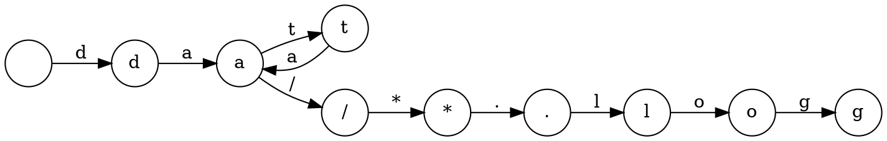

Response:
Let's break down the thought process for answering this request.

1. **Understand the Goal:** The core request is to analyze the provided Go code snippet and explain its functionality, particularly focusing on how it uses Go features and its command-line interface. The context indicates this is part of a larger project related to glob pattern matching.

2. **Initial Code Scan (Keywords and Imports):**
   - `package main`:  Indicates an executable program.
   - `import`:  Highlights the dependencies:
     - `"flag"`:  Immediately suggests command-line argument parsing.
     - `"fmt"`:  For printing output (likely errors and the final result).
     - `"github.com/gobwas/glob"`:  This is the core library being used, pointing to glob pattern matching functionality.
     - `"github.com/gobwas/glob/match"`:  Suggests internal interfaces for matching.
     - `"github.com/gobwas/glob/match/debug"`:  A key clue! "debug" often implies tools for introspection or visualization.
     - `"os"`:  For interacting with the operating system (exiting, standard output).
     - `"strings"`:  For string manipulation (likely parsing the separator list).
     - `"unicode/utf8"`:  Indicates handling of UTF-8 characters (important for separators).

3. **Analyzing the `main` Function Step-by-Step:**
   - **`flag.String(...)`:**  Confirms command-line flag parsing. The flags `-p` (pattern) and `-s` (separators) are defined. This immediately tells us how the program takes input.
   - **`flag.Parse()`:**  Processes the command-line arguments.
   - **Input Validation (`*pattern == ""`):** Checks if a pattern was provided. If not, prints usage and exits. This is standard command-line program behavior.
   - **Separator Handling:**
     - Checks if the `-s` flag was used (`len(*sep) > 0`).
     - `strings.Split(*sep, ",")`:  Splits the separator string by commas.
     - The loop iterates through the split separators.
     - `utf8.DecodeRuneInString(c)`:  Crucially, it handles potentially multi-byte UTF-8 characters.
     - `len(c) > w`:  This is the validation step ensuring each separator is a single character. This is an important constraint to note.
     - `separators = append(separators, r)`:  Appends the valid separator runes to the `separators` slice.
   - **Glob Compilation:**
     - `glob.Compile(*pattern, separators...)`: This is where the core glob library is used. It compiles the provided pattern and optional separators into an internal representation. The potential for errors here is handled.
   - **Type Assertion:**
     - `matcher := glob.(match.Matcher)`:  This asserts that the compiled glob object implements the `match.Matcher` interface. This is important for understanding the interaction with the `debug` package.
   - **Graphviz Output:**
     - `fmt.Fprint(os.Stdout, debug.Graphviz(*pattern, matcher))`:  The biggest reveal!  The `debug.Graphviz` function takes the original pattern and the compiled matcher and generates a Graphviz representation. This is the primary function of the program.

4. **Inferring the Functionality:** Based on the code analysis, the program's main function is to:
   - Take a glob pattern as input.
   - Optionally take a comma-separated list of separator characters.
   - Compile the glob pattern using the provided separators.
   - Generate a Graphviz representation of the compiled glob, showing its internal structure.

5. **Illustrative Go Code Example:** To demonstrate the core glob matching functionality (although this specific program focuses on visualization), a simple example showing how to *use* a compiled glob is helpful. This requires showing how to match strings against the compiled pattern.

6. **Command-Line Arguments:**  Document the `-p` and `-s` flags, explaining their purpose and syntax.

7. **Common Mistakes:** Focus on the separator constraint (single characters) as a likely point of error for users.

8. **Structure and Language:** Organize the answer logically with clear headings. Use precise and understandable Chinese. Avoid overly technical jargon where possible, but explain necessary terms.

**Self-Correction/Refinement during the process:**

* Initially, I might have focused too much on the glob matching itself. The key realization is that the `debug.Graphviz` call is the central action.
* I need to clearly distinguish between *using* a glob for matching and this program's purpose of *visualizing* the glob's structure. The Go code example helps illustrate the former while the main analysis covers the latter.
* Ensure the explanation of the separator handling is accurate, especially regarding the UTF-8 aspect.
* Double-check the command-line flag syntax and descriptions.

By following this structured approach, analyzing the code, and iteratively refining the understanding, I can generate a comprehensive and accurate answer to the user's request.
这段Go语言程序 `main.go` 的主要功能是**将一个给定的 glob 模式可视化为 Graphviz 的 DOT 语言表示**。这有助于开发者理解 glob 模式是如何被解析和匹配的。

让我们分解一下其功能：

**1. 接收命令行参数：**

   - `-p string`:  指定要绘制的 glob 模式。这是必须提供的参数。
   - `-s string`:  指定分隔符字符的逗号分隔列表。这个是可选的。

   程序使用 `flag` 包来处理这些命令行参数。

**2. 处理分隔符：**

   - 如果提供了 `-s` 参数，程序会将逗号分隔的字符串拆分成单个字符。
   - **重要限制：** 程序会检查每个分隔符是否是**单个字符**。如果遇到多字符的分隔符，程序会报错并退出。

**3. 编译 glob 模式：**

   - 使用 `github.com/gobwas/glob` 库的 `glob.Compile()` 函数，将输入的模式和解析后的分隔符列表编译成一个内部的 glob 对象。
   - 如果编译过程中发生错误（例如，模式语法错误），程序会打印错误信息并退出。

**4. 生成 Graphviz 表示：**

   - 将编译后的 glob 对象断言为 `match.Matcher` 接口类型。
   - 使用 `github.com/gobwas/glob/match/debug` 包中的 `debug.Graphviz()` 函数，该函数接收原始的模式字符串和 `match.Matcher` 对象，并生成 Graphviz 的 DOT 语言字符串。
   - 将生成的 DOT 语言字符串输出到标准输出 (`os.Stdout`)。

**总结：** 这个程序接收一个 glob 模式，并将其内部结构以 Graphviz 的图形形式展示出来，这对于理解 glob 匹配的原理很有帮助。

**推理其实现的 Go 语言功能：**

这个程序主要使用了以下 Go 语言功能：

- **命令行参数解析 (`flag` 包):**  用于接收用户输入的模式和分隔符。
- **字符串处理 (`strings` 包):** 用于分割分隔符字符串。
- **Unicode 字符处理 (`unicode/utf8` 包):**  用于确保分隔符是单个字符。
- **类型断言:** 将编译后的 glob 对象断言为 `match.Matcher` 接口类型。
- **接口:** `match.Matcher` 是一个接口，定义了 glob 匹配的行为。
- **错误处理:** 检查编译 glob 模式时是否发生错误。
- **标准输出:** 将生成的 Graphviz DOT 语言输出到控制台。

**Go 代码举例说明 glob 匹配功能：**

虽然 `globdraw` 本身是用于 *可视化* glob 模式的，但我们可以举例说明 `github.com/gobwas/glob` 库是如何进行实际的 glob 匹配的：

```go
package main

import (
	"fmt"
	"github.com/gobwas/glob"
)

func main() {
	pattern := "file_*.txt"
	g, err := glob.Compile(pattern)
	if err != nil {
		fmt.Println("Error compiling pattern:", err)
		return
	}

	testStrings := []string{"file_a.txt", "file_b.txt", "file_123.txt", "other_file.txt"}

	for _, s := range testStrings {
		if g.Match(s) {
			fmt.Printf("'%s' matches pattern '%s'\n", s, pattern)
		} else {
			fmt.Printf("'%s' does not match pattern '%s'\n", s, pattern)
		}
	}
}
```

**假设输入与输出：**

**假设输入：**

```
go run main.go -p "data/*.log"
```

**可能的输出（Graphviz DOT 语言片段）：**



这个 DOT 语言描述了一个有向图，表示了 glob 模式 `data/*.log` 的匹配过程。你可以使用 Graphviz 工具（如 `dot` 命令）将此输出转换为图像。

**命令行参数的具体处理：**

- **`-p` 参数：**
    - 必须提供。
    - 接受一个字符串作为 glob 模式。
    - 例如：`go run main.go -p "*.go"`
- **`-s` 参数：**
    - 可选。
    - 接受一个逗号分隔的字符列表作为分隔符。
    - 例如：`go run main.go -p "a/b/c" -s "/"`  这里的 `/` 就是分隔符。
    - 例如：`go run main.go -p "a.b.c" -s .,` 这里的 `.` 和 `,` 都是分隔符。

**使用者易犯错的点：**

1. **分隔符必须是单字符：**  这是最容易出错的地方。如果用户尝试使用多字符的分隔符，程序会报错。

   **错误示例：**

   ```bash
   go run main.go -p "a--b--c" -s "--"
   ```

   **输出：**

   ```
   only single charactered separators are allowed
   exit status 1
   ```

   **正确示例：**

   ```bash
   go run main.go -p "a--b--c" -s "-"
   ```

2. **忘记提供 `-p` 参数：** 如果运行程序时没有提供 `-p` 参数，程序会打印帮助信息并退出。

   **错误示例：**

   ```bash
   go run main.go
   ```

   **输出（类似）：**

   ```
   Usage of /tmp/go-build638613076/b001/exe/main:
    -p string
        pattern to draw
    -s string
        comma separated list of separators characters
   exit status 1
   ```

总而言之，`globdraw` 是一个用于调试和理解 glob 模式的实用工具，通过将其内部结构可视化，帮助开发者更好地掌握 glob 匹配的原理。使用者需要注意分隔符的限制以及必须提供模式参数。

Prompt: 
```
这是路径为go/src/github.com/alecthomas/gometalinter/_linters/src/github.com/client9/misspell/vendor/github.com/gobwas/glob/cmd/globdraw/main.go的go语言实现的一部分， 请列举一下它的功能, 　
如果你能推理出它是什么go语言功能的实现，请用go代码举例说明, 
如果涉及代码推理，需要带上假设的输入与输出，
如果涉及命令行参数的具体处理，请详细介绍一下，
如果有哪些使用者易犯错的点，请举例说明，没有则不必说明，
请用中文回答。

"""
package main

import (
	"flag"
	"fmt"
	"github.com/gobwas/glob"
	"github.com/gobwas/glob/match"
	"github.com/gobwas/glob/match/debug"
	"os"
	"strings"
	"unicode/utf8"
)

func main() {
	pattern := flag.String("p", "", "pattern to draw")
	sep := flag.String("s", "", "comma separated list of separators characters")
	flag.Parse()

	if *pattern == "" {
		flag.Usage()
		os.Exit(1)
	}

	var separators []rune
	if len(*sep) > 0 {
		for _, c := range strings.Split(*sep, ",") {
			if r, w := utf8.DecodeRuneInString(c); len(c) > w {
				fmt.Println("only single charactered separators are allowed")
				os.Exit(1)
			} else {
				separators = append(separators, r)
			}
		}
	}

	glob, err := glob.Compile(*pattern, separators...)
	if err != nil {
		fmt.Println("could not compile pattern:", err)
		os.Exit(1)
	}

	matcher := glob.(match.Matcher)
	fmt.Fprint(os.Stdout, debug.Graphviz(*pattern, matcher))
}

"""


```