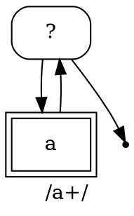

Response:
Let's break down the thought process for analyzing this C++ code.

1. **Understand the Goal:** The core purpose of the code is to visualize a regular expression's internal structure as a graph. The output format is DOT language, which can be rendered by tools like Graphviz.

2. **Identify the Key Classes:**  Scan the code for class definitions. The most prominent is `DotPrinterImpl`, and `AttributePrinter` seems like a helper. The presence of `RegExpNode` and its derived types (`ChoiceNode`, `TextNode`, etc.) suggests this code deals with a representation of a regular expression.

3. **Focus on `DotPrinterImpl`:** This class has a `PrintNode` method which seems to be the entry point. It writes the DOT header (`digraph G`) and footer. The `Visit` method likely handles traversing the graph.

4. **Analyze the `Visit` Method and Derived Visitors:** The `Visit` method uses an `Accept` method on `RegExpNode`. This strongly suggests a Visitor pattern implementation. The `DECLARE_VISIT` macro confirms this. Each `Visit[NodeType]` method is responsible for generating DOT code for that specific type of node.

5. **Examine the Output Generation:** Look at how the DOT language is constructed. Nodes are created with `os_ << "  n" << node << ...` (likely using memory addresses as unique identifiers). Edges between nodes are created with `os_ << "  n" << from << " -> n" << to << ...`. Different shapes and labels are used based on the node type.

6. **Understand `PrintAttributes`:** This function prints additional information about a node as a separate "attribute node" linked with a dashed edge. It uses the `AttributePrinter` to format the attributes. The attributes (NI, WI, SI, @) likely represent internal state relevant to the regex engine.

7. **Connect to Regular Expression Concepts:**  Relate the node types to familiar regex constructs:
    * `TextNode`:  Literal characters or character classes.
    * `ChoiceNode`:  Alternation (the `|` operator).
    * `LoopChoiceNode`: Likely for loops/quantifiers like `*`, `+`, `{}`.
    * `BackReferenceNode`:  `\1`, `\2`, etc.
    * `AssertionNode`: Anchors (`^`, `$`, `\b`, `\B`) and lookarounds.
    * `ActionNode`: Internal operations within the regex engine, like capturing groups or flag modifications.
    * `EndNode`:  The end of a successful match path.

8. **Infer Functionality:** Based on the DOT output and the node types, the primary function is to create a visual representation of the compiled regular expression. This can be useful for:
    * **Debugging:** Understanding how the regex engine will traverse the state machine.
    * **Optimization:** Identifying potential bottlenecks or complex structures.
    * **Education:** Visualizing the abstract concept of a regular expression's execution.

9. **Consider the `.tq` Question:** The prompt asks about `.tq` files. Based on common V8 conventions and the description of Torque, it's likely that if the file *were* `.tq`, it would be related to a higher-level, more abstract specification of the regex logic, possibly used for generating the C++ code or for formal verification.

10. **Think about JavaScript Relevance:**  Since regular expressions are a core part of JavaScript, this code directly supports the functionality of JavaScript's `RegExp` object. A JavaScript example would demonstrate how to create a regex that this code could then visualize.

11. **Devise Input/Output Examples:** Create simple regular expressions and mentally (or by sketching) imagine what the DOT graph would look like. This helps to solidify understanding and provides concrete examples.

12. **Consider Common Programming Errors:**  Think about common mistakes users make with regular expressions (e.g., incorrect escaping, misunderstanding backreferences, complex lookarounds). These mistakes would result in complex graphs visualized by this code.

13. **Structure the Answer:** Organize the findings into logical sections: functionality, `.tq` explanation, JavaScript examples, input/output, and common errors. Use clear and concise language.

**Self-Correction/Refinement during the process:**

* **Initial thought:**  Maybe the code directly *executes* regular expressions. **Correction:** The presence of "printer" and the DOT output strongly suggest visualization, not execution.
* **Uncertainty about `ActionNode`:** The different action types are a bit cryptic. **Refinement:** Focus on the general idea that these represent internal operations, and give a few examples without needing to fully understand every detail.
* **Wondering about the purpose of attributes:**  They seem like internal flags. **Refinement:**  Note that they are likely for internal engine state, without needing to know the exact meaning of each flag.

By following this systematic approach, combining code analysis with knowledge of regular expression concepts and V8's architecture, a comprehensive and accurate answer can be generated.
根据提供的V8源代码文件 `v8/src/regexp/regexp-dotprinter.cc`，我们可以分析出它的功能：

**主要功能：将正则表达式的内部结构以 DOT 语言格式输出，用于可视化正则表达式的状态机图。**

具体来说，该文件的作用是：

1. **构建正则表达式的图形表示：** 它遍历 V8 内部表示的正则表达式结构（由 `RegExpNode` 及其子类构成），并将这些节点和它们之间的关系转换成 DOT 语言的描述。
2. **输出 DOT 代码：** 生成的 DOT 代码可以被 Graphviz 等工具解析，从而渲染出清晰的正则表达式状态转移图。

**更详细的功能点：**

* **节点类型处理：** 针对不同类型的 `RegExpNode`（例如 `ChoiceNode`、`TextNode`、`BackReferenceNode`、`AssertionNode`、`ActionNode`、`EndNode` 等），生成不同的 DOT 节点和标签。
* **连接节点：**  根据正则表达式的结构，在 DOT 图中创建节点之间的边，表示状态之间的转移。
* **属性输出：** 可以输出节点的额外属性信息，例如是否关注换行符、单词边界、字符串起始位置等。
* **表示匹配成功/失败：**  使用不同的线条样式（实线表示成功转移，虚线表示可能的失败转移）来区分节点之间的连接。
* **支持多种正则表达式构造：**  能够处理选择分支、循环、后向引用、断言等各种正则表达式语法结构。
* **输出动作节点：** 可以可视化正则表达式执行过程中的一些“动作”，例如设置寄存器、增加寄存器、存储位置等，这对于理解引擎内部的执行流程很有帮助。

**关于文件后缀名 `.tq`：**

你提到如果 `v8/src/regexp/regexp-dotprinter.cc` 以 `.tq` 结尾，它将是 V8 Torque 源代码。这是正确的。

* **Torque:** Torque 是 V8 使用的一种领域特定语言（DSL），用于定义 V8 内部的运行时函数和类型。它允许用更高级、更类型安全的方式编写 C++ 代码，并能进行一些静态检查和优化。
* **`.tq` 文件：**  `.tq` 文件包含了 Torque 编写的源代码。

**与 JavaScript 的功能关系：**

`v8/src/regexp/regexp-dotprinter.cc`  虽然本身是 C++ 代码，但它直接服务于 JavaScript 的正则表达式功能。当你在 JavaScript 中使用 `RegExp` 对象进行模式匹配时，V8 内部会将正则表达式编译成一种内部表示。 `regexp-dotprinter.cc` 的作用就是将这种内部表示转换成可视化的图形，帮助开发者和 V8 团队理解正则表达式的结构。

**JavaScript 示例：**

```javascript
const regex = /ab|c*/g;
// 在 V8 内部，这个 regex 会被编译成一种图结构。
// regexp-dotprinter.cc 的作用就是将这个图结构输出成 DOT 格式。

// V8 并没有直接提供 JavaScript API 来调用 regexp-dotprinter.cc。
// 这个功能通常用于 V8 的开发和调试。

// 如果 V8 提供了相应的调试接口（例如，通过特定的 flag 或内部函数），
// 你可能会得到类似下面的 DOT 输出：

// digraph G {
//   graph [label="ab|c*"];
//   n1 [shape=Mrecord, label="?"];
//   n1 -> n2;
//   n1 -> n3;
//   n2 [label="a", shape=box, peripheries=2];
//   n2 -> n4;
//   n4 [label="b", shape=box, peripheries=2];
//   n4 -> n5;
//   n5 [style=bold, shape=point];
//   n3 [shape=Mrecord, label="?"];
//   n3 -> n6;
//   n6 [label="c", shape=box, peripheries=2];
//   n6 -> n3;
//   n3 -> n7;
//   n7 [style=bold, shape=point];
// }
```

上面的 DOT 代码是 `const regex = /ab|c*/g;` 这个正则表达式可能生成的一种简化表示。你可以将这段代码复制到 Graphviz 在线编辑器或本地安装的 Graphviz 工具中，就能看到相应的状态转移图。

**代码逻辑推理 (假设输入与输出)：**

**假设输入 (JavaScript 正则表达式)：** `/a+/`

**V8 内部可能构建的 `RegExpNode` 结构 (简化)：**

1. **`LoopChoiceNode` (表示 `+` 循环)：**  入口节点。
2. **`TextNode` (表示字符 `a`)：**  匹配字符 'a'。
3. **连接：** `LoopChoiceNode` 连接到 `TextNode`， `TextNode` 的成功分支连接回 `LoopChoiceNode` (用于循环)， `LoopChoiceNode` 还有一个成功分支跳出循环。
4. **`EndNode`：**  表示匹配结束。

**可能的 DOT 输出：**



**用户常见的编程错误举例：**

使用正则表达式时，用户常常会犯一些错误，而 `regexp-dotprinter.cc` 输出的图形可以帮助理解这些错误是如何影响正则表达式的结构和执行的。

1. **括号不匹配或错误嵌套：** 例如 `/a(b|c/` 或 `/a(|b)/`。 这会导致正则表达式解析错误，V8 可能无法正确构建内部表示，或者构建出的图结构不符合预期。

2. **不正确的转义字符：** 例如希望匹配 `.` 却写成 `/./` (这将匹配任意字符)，或者忘记转义特殊字符导致意想不到的匹配行为。  可视化工具能清晰地展示字符类或字面量匹配。

   **例子：**
   * **错误：** `const regex = /c:\path\to\file/`;  // 这里的反斜杠需要转义
   * **正确：** `const regex = /c:\\path\\to\\file/`;

   如果使用错误的转义，`regexp-dotprinter.cc` 生成的图可能会显示 `p`、`t`、`f` 等被解释为转义字符，而不是字面量。

3. **对量词的误解：**  例如，认为 `/a*/` 至少匹配一个 'a'，但实际上它可以匹配零个。  可视化工具会显示 `a` 节点可以被跳过。

4. **复杂的后向引用或断言：**  复杂的后向引用或断言可能会导致生成非常复杂的图，帮助开发者理解其执行路径和可能的回溯行为。例如，嵌套的捕获组和后向引用可能会使状态图变得复杂，通过可视化可以更清晰地理解匹配过程。

总之，`v8/src/regexp/regexp-dotprinter.cc` 是一个用于 V8 内部正则表达式调试和理解的重要工具，它通过将正则表达式的内部结构可视化，帮助开发者和 V8 团队更好地理解正则表达式的执行方式和潜在问题。虽然普通 JavaScript 开发者不能直接调用它，但理解其功能有助于更深入地了解 JavaScript 正则表达式的底层机制。

Prompt: 
```
这是目录为v8/src/regexp/regexp-dotprinter.cc的一个v8源代码， 请列举一下它的功能, 
如果v8/src/regexp/regexp-dotprinter.cc以.tq结尾，那它是个v8 torque源代码，
如果它与javascript的功能有关系，请用javascript举例说明,
如果有代码逻辑推理，请给出假设输入与输出，
如果涉及用户常见的编程错误，请举例说明

"""
// Copyright 2019 the V8 project authors. All rights reserved.
// Use of this source code is governed by a BSD-style license that can be
// found in the LICENSE file.

#include "src/regexp/regexp-dotprinter.h"

#include "src/base/strings.h"
#include "src/regexp/regexp-compiler.h"
#include "src/utils/ostreams.h"

namespace v8 {
namespace internal {

// -------------------------------------------------------------------
// Dot/dotty output

class DotPrinterImpl : public NodeVisitor {
 public:
  explicit DotPrinterImpl(std::ostream& os) : os_(os) {}
  void PrintNode(const char* label, RegExpNode* node);
  void Visit(RegExpNode* node);
  void PrintAttributes(RegExpNode* from);
  void PrintOnFailure(RegExpNode* from, RegExpNode* to);
#define DECLARE_VISIT(Type) virtual void Visit##Type(Type##Node* that);
  FOR_EACH_NODE_TYPE(DECLARE_VISIT)
#undef DECLARE_VISIT
 private:
  std::ostream& os_;
};

void DotPrinterImpl::PrintNode(const char* label, RegExpNode* node) {
  os_ << "digraph G {\n  graph [label=\"";
  for (int i = 0; label[i]; i++) {
    switch (label[i]) {
      case '\\':
        os_ << "\\\\";
        break;
      case '"':
        os_ << "\"";
        break;
      default:
        os_ << label[i];
        break;
    }
  }
  os_ << "\"];\n";
  Visit(node);
  os_ << "}" << std::endl;
}

void DotPrinterImpl::Visit(RegExpNode* node) {
  if (node->info()->visited) return;
  node->info()->visited = true;
  node->Accept(this);
}

void DotPrinterImpl::PrintOnFailure(RegExpNode* from, RegExpNode* on_failure) {
  os_ << "  n" << from << " -> n" << on_failure << " [style=dotted];\n";
  Visit(on_failure);
}

class AttributePrinter {
 public:
  explicit AttributePrinter(std::ostream& os) : os_(os), first_(true) {}
  void PrintSeparator() {
    if (first_) {
      first_ = false;
    } else {
      os_ << "|";
    }
  }
  void PrintBit(const char* name, bool value) {
    if (!value) return;
    PrintSeparator();
    os_ << "{" << name << "}";
  }
  void PrintPositive(const char* name, int value) {
    if (value < 0) return;
    PrintSeparator();
    os_ << "{" << name << "|" << value << "}";
  }

 private:
  std::ostream& os_;
  bool first_;
};

void DotPrinterImpl::PrintAttributes(RegExpNode* that) {
  os_ << "  a" << that << " [shape=Mrecord, color=grey, fontcolor=grey, "
      << "margin=0.1, fontsize=10, label=\"{";
  AttributePrinter printer(os_);
  NodeInfo* info = that->info();
  printer.PrintBit("NI", info->follows_newline_interest);
  printer.PrintBit("WI", info->follows_word_interest);
  printer.PrintBit("SI", info->follows_start_interest);
  Label* label = that->label();
  if (label->is_bound()) printer.PrintPositive("@", label->pos());
  os_ << "}\"];\n"
      << "  a" << that << " -> n" << that
      << " [style=dashed, color=grey, arrowhead=none];\n";
}

void DotPrinterImpl::VisitChoice(ChoiceNode* that) {
  os_ << "  n" << that << " [shape=Mrecord, label=\"?\"];\n";
  for (int i = 0; i < that->alternatives()->length(); i++) {
    GuardedAlternative alt = that->alternatives()->at(i);
    os_ << "  n" << that << " -> n" << alt.node();
  }
  for (int i = 0; i < that->alternatives()->length(); i++) {
    GuardedAlternative alt = that->alternatives()->at(i);
    alt.node()->Accept(this);
  }
  PrintAttributes(that);
}

void DotPrinterImpl::VisitLoopChoice(LoopChoiceNode* that) {
  VisitChoice(that);
}

void DotPrinterImpl::VisitNegativeLookaroundChoice(
    NegativeLookaroundChoiceNode* that) {
  VisitChoice(that);
}

void DotPrinterImpl::VisitText(TextNode* that) {
  Zone* zone = that->zone();
  os_ << "  n" << that << " [label=\"";
  for (int i = 0; i < that->elements()->length(); i++) {
    if (i > 0) os_ << " ";
    TextElement elm = that->elements()->at(i);
    switch (elm.text_type()) {
      case TextElement::ATOM: {
        base::Vector<const base::uc16> data = elm.atom()->data();
        for (int j = 0; j < data.length(); j++) {
          os_ << static_cast<char>(data[j]);
        }
        break;
      }
      case TextElement::CLASS_RANGES: {
        RegExpClassRanges* node = elm.class_ranges();
        os_ << "[";
        if (node->is_negated()) os_ << "^";
        for (int j = 0; j < node->ranges(zone)->length(); j++) {
          CharacterRange range = node->ranges(zone)->at(j);
          os_ << AsUC32(range.from()) << "-" << AsUC32(range.to());
        }
        os_ << "]";
        break;
      }
      default:
        UNREACHABLE();
    }
  }
  os_ << "\", shape=box, peripheries=2];\n";
  PrintAttributes(that);
  os_ << "  n" << that << " -> n" << that->on_success() << ";\n";
  Visit(that->on_success());
}

void DotPrinterImpl::VisitBackReference(BackReferenceNode* that) {
  os_ << "  n" << that << " [label=\"$" << that->start_register() << "..$"
      << that->end_register() << "\", shape=doubleoctagon];\n";
  PrintAttributes(that);
  os_ << "  n" << that << " -> n" << that->on_success() << ";\n";
  Visit(that->on_success());
}

void DotPrinterImpl::VisitEnd(EndNode* that) {
  os_ << "  n" << that << " [style=bold, shape=point];\n";
  PrintAttributes(that);
}

void DotPrinterImpl::VisitAssertion(AssertionNode* that) {
  os_ << "  n" << that << " [";
  switch (that->assertion_type()) {
    case AssertionNode::AT_END:
      os_ << "label=\"$\", shape=septagon";
      break;
    case AssertionNode::AT_START:
      os_ << "label=\"^\", shape=septagon";
      break;
    case AssertionNode::AT_BOUNDARY:
      os_ << "label=\"\\b\", shape=septagon";
      break;
    case AssertionNode::AT_NON_BOUNDARY:
      os_ << "label=\"\\B\", shape=septagon";
      break;
    case AssertionNode::AFTER_NEWLINE:
      os_ << "label=\"(?<=\\n)\", shape=septagon";
      break;
  }
  os_ << "];\n";
  PrintAttributes(that);
  RegExpNode* successor = that->on_success();
  os_ << "  n" << that << " -> n" << successor << ";\n";
  Visit(successor);
}

void DotPrinterImpl::VisitAction(ActionNode* that) {
  os_ << "  n" << that << " [";
  switch (that->action_type_) {
    case ActionNode::SET_REGISTER_FOR_LOOP:
      os_ << "label=\"$" << that->data_.u_store_register.reg
          << ":=" << that->data_.u_store_register.value << "\", shape=octagon";
      break;
    case ActionNode::INCREMENT_REGISTER:
      os_ << "label=\"$" << that->data_.u_increment_register.reg
          << "++\", shape=octagon";
      break;
    case ActionNode::STORE_POSITION:
      os_ << "label=\"$" << that->data_.u_position_register.reg
          << ":=$pos\", shape=octagon";
      break;
    case ActionNode::BEGIN_POSITIVE_SUBMATCH:
      os_ << "label=\"$" << that->data_.u_submatch.current_position_register
          << ":=$pos,begin-positive\", shape=septagon";
      break;
    case ActionNode::BEGIN_NEGATIVE_SUBMATCH:
      os_ << "label=\"$" << that->data_.u_submatch.current_position_register
          << ":=$pos,begin-negative\", shape=septagon";
      break;
    case ActionNode::POSITIVE_SUBMATCH_SUCCESS:
      os_ << "label=\"escape\", shape=septagon";
      break;
    case ActionNode::EMPTY_MATCH_CHECK:
      os_ << "label=\"$" << that->data_.u_empty_match_check.start_register
          << "=$pos?,$" << that->data_.u_empty_match_check.repetition_register
          << "<" << that->data_.u_empty_match_check.repetition_limit
          << "?\", shape=septagon";
      break;
    case ActionNode::CLEAR_CAPTURES: {
      os_ << "label=\"clear $" << that->data_.u_clear_captures.range_from
          << " to $" << that->data_.u_clear_captures.range_to
          << "\", shape=septagon";
      break;
    }
    case ActionNode::MODIFY_FLAGS: {
      os_ << "label=\"flags $" << that->flags() << "\", shape=septagon";
      break;
    }
  }
  os_ << "];\n";
  PrintAttributes(that);
  RegExpNode* successor = that->on_success();
  os_ << "  n" << that << " -> n" << successor << ";\n";
  Visit(successor);
}

void DotPrinter::DotPrint(const char* label, RegExpNode* node) {
  StdoutStream os;
  DotPrinterImpl printer(os);
  printer.PrintNode(label, node);
}

}  // namespace internal
}  // namespace v8

"""

```