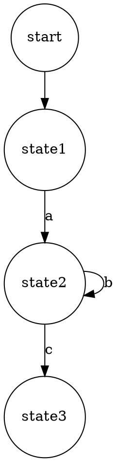
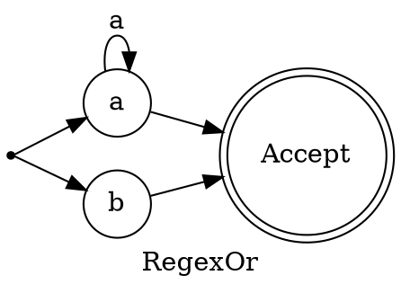

Response:
Let's break down the thought process to analyze the provided C++ header file.

1. **Understand the Goal:** The request asks for an analysis of `v8/src/regexp/regexp-dotprinter.h`, focusing on its functionality, connection to JavaScript, potential Torque nature, illustrative examples, and common user errors related to its purpose (if applicable).

2. **Initial Code Scan (Keywords and Structure):**  The first step is to quickly scan the code for keywords and understand its basic structure. I see:
    * `// Copyright`: Standard copyright notice.
    * `#ifndef`, `#define`, `#endif`: Header guard, indicating this is a header file designed to be included in other C++ files.
    * `#include "src/common/globals.h"`: Includes another V8 header, suggesting dependency on core V8 types.
    * `namespace v8 { namespace internal { ... } }`:  Indicates this code belongs to the internal implementation of the V8 JavaScript engine.
    * `class RegExpNode;`: Forward declaration of a `RegExpNode` class, suggesting this file deals with regular expression structures.
    * `class DotPrinter final : public AllStatic { ... };`:  Defines a class named `DotPrinter`, marked as `final` (cannot be inherited from) and inheriting from `AllStatic` (presumably a V8 class indicating it contains only static members).
    * `static void DotPrint(const char* label, RegExpNode* node);`: The core function of the `DotPrinter` class. It's static, takes a label (C-style string) and a pointer to a `RegExpNode`.

3. **Deduce Functionality:** Based on the class name `DotPrinter` and the function `DotPrint`, the primary function seems to be related to visualizing or representing some structure (likely a regular expression) in the "dot" format. The `label` argument likely allows for adding a descriptive name to the generated output.

4. **Address the ".tq" Question:** The prompt asks if the file were named with a `.tq` extension. I know that `.tq` signifies Torque (TypeScript-like language for V8 internal implementation). Since this is a `.h` file (C++ header), it's *not* a Torque file. This needs to be stated clearly.

5. **Connect to JavaScript:** The path `v8/src/regexp/` strongly suggests this code is related to how V8 handles regular expressions in JavaScript. The `RegExpNode` likely represents the internal representation of a JavaScript regular expression. Therefore, the `DotPrinter` probably helps in debugging or understanding how V8 parses and represents regexes. To illustrate this, provide simple JavaScript regex examples.

6. **Illustrative Examples (Hypothetical Input/Output):** Since we don't have the actual implementation of `DotPrint`, we can only *hypothesize* what the output might look like. The "dot" format is a graph description language. So, I'd expect the output to represent the structure of a regular expression as a graph with nodes and edges. Provide examples of simple regexes and their potential dot representation (even a simplified sketch). *Crucially, acknowledge that this is hypothetical.*

7. **Common User Errors:**  Think about how this internal tool might be *indirectly* related to user errors. Users don't directly call `DotPrint`. However, understanding the internal representation of regexes can help understand *why* certain regexes behave in unexpected ways. Focus on common regex pitfalls:
    * Incorrect escaping of special characters.
    * Greedy vs. non-greedy matching.
    * Misunderstanding character classes or quantifiers.
    * Catastrophic backtracking (though `DotPrinter` might not directly reveal this, understanding the structure could hint at complex patterns).

8. **Structure the Response:** Organize the information logically to address all parts of the prompt:
    * Start with the primary function of the header file.
    * Address the `.tq` question directly.
    * Explain the connection to JavaScript with examples.
    * Provide hypothetical input/output for `DotPrint`, emphasizing the speculative nature.
    * Discuss relevant common user errors related to regular expressions in general.

9. **Refine and Review:** Read through the answer to ensure clarity, accuracy, and completeness. Check for any logical gaps or unclear explanations. For example, initially I might have just said "it prints in dot format."  But refining that to "represents the internal structure of a regular expression as a graph, suitable for visualization with tools like Graphviz" makes it much clearer. Also, explicitly stating the limitations (we don't see the actual implementation) is important.
好的，让我们来分析一下 `v8/src/regexp/regexp-dotprinter.h` 这个 V8 源代码文件。

**功能列举:**

`v8/src/regexp/regexp-dotprinter.h` 定义了一个名为 `DotPrinter` 的类，这个类的主要功能是：

* **将正则表达式的内部结构以 "dot" 格式打印出来。** "dot" 是一种图形描述语言，常用于创建图形，例如流程图或网络图。通过将正则表达式的内部表示转换为 dot 格式，可以方便地使用 Graphviz 等工具将其可视化。

**关于 .tq 结尾:**

* **如果 `v8/src/regexp/regexp-dotprinter.h` 以 `.tq` 结尾，那么它确实是 V8 的 Torque 源代码。** Torque 是一种用于编写 V8 内部实现的领域特定语言，它类似于 TypeScript，但用于生成高效的 C++ 代码。
* **然而，根据你提供的文件内容，这个文件以 `.h` 结尾，因此它是一个 C++ 头文件。**  它声明了一个 C++ 类 `DotPrinter`。

**与 JavaScript 功能的关系:**

`DotPrinter` 的功能与 JavaScript 的正则表达式息息相关。 当你在 JavaScript 中使用正则表达式时，V8 引擎会在内部将其解析并构建一个内部表示。 `DotPrinter` 类的目的就是将这个内部表示以可读的图形格式输出，主要用于 V8 开发者进行调试、分析和理解正则表达式的内部结构。

**JavaScript 示例:**

尽管用户不能直接调用 `DotPrinter`，但当 V8 执行 JavaScript 正则表达式时，`DotPrinter::DotPrint` 方法可能会被内部调用（通常是在调试或测试模式下），以生成正则表达式结构的 dot 文件。

例如，考虑以下 JavaScript 正则表达式：

```javascript
const regex = /ab*c/g;
```

当 V8 处理这个正则表达式时，`DotPrinter` 可能会生成类似以下的 dot 格式输出（这只是一个简化的例子，实际输出会更详细）：



这个 dot 描述可以被 Graphviz 渲染成一个状态机图，展示了正则表达式的匹配过程。

**代码逻辑推理 (假设输入与输出):**

假设 `DotPrint` 函数被调用，输入为一个表示正则表达式 `/a+|b/` 的 `RegExpNode` 对象，标签为 "RegexOr".

**假设输入:**

* `label`: "RegexOr"
* `node`: 指向表示正则表达式 `/a+|b/` 内部结构的 `RegExpNode` 对象的指针。

**可能的输出 (dot 格式):**



**解释:**

* `digraph RegExp`: 定义一个名为 "RegExp" 的有向图。
* `label="RegexOr"`: 设置图的标签。
* `rankdir=LR`:  指定布局方向为从左到右。
* `node [shape=circle]`: 设置节点的默认形状为圆形。
* `start` 和 `accept`: 表示匹配的起始和接受状态。
* `state1` 和 `state2`:  表示正则表达式中的不同部分。
* 箭头表示状态之间的转换，标签表示触发转换的字符。

**用户常见的编程错误 (与正则表达式相关):**

虽然用户不会直接操作 `DotPrinter`，但理解正则表达式的内部结构有助于避免以下常见的编程错误：

1. **过度使用或不必要的复杂正则表达式:**  有时可以用更简单的逻辑实现相同的功能。可视化正则表达式的内部结构可以帮助识别复杂度。例如，一个过于复杂的正则表达式可能导致性能问题（回溯）。

   ```javascript
   // 错误示例：过于复杂的正则表达式
   const text = "aaaaabbbbcccc";
   const regex = /a*b*c*/; // 这种情况下使用 String 的方法可能更清晰
   ```

2. **忘记转义特殊字符:** 正则表达式中有一些特殊字符，如果需要匹配这些字符本身，必须进行转义。

   ```javascript
   // 错误示例：忘记转义点号
   const text = "example.com";
   const regex = /.com/; // 错误：. 匹配任意字符
   const correctRegex = /\.com/; // 正确：\. 匹配字面意义的点号
   ```

3. **对贪婪和非贪婪匹配理解不足:**  默认情况下，量词（如 `*`, `+`, `{n,m}`）是贪婪的，会尽可能多地匹配。有时需要使用非贪婪匹配 (`*?`, `+?`, `{n,m}?`)。

   ```javascript
   // 错误示例：贪婪匹配导致意外结果
   const text = "<a>text</a>";
   const regex = /<.*>/; // 匹配 "<a>text</a>"
   const nonGreedyRegex = /<.*?>/; // 匹配 "<a>"
   ```

4. **字符类的使用错误:** 对字符类（如 `[abc]`, `\d`, `\w`）的理解偏差可能导致匹配错误。

   ```javascript
   // 错误示例：字符类使用错误
   const text = "file123";
   const regex = /[a-z0-9]/; // 只能匹配一个字母或数字
   const correctRegex = /[a-z0-9]+/; // 匹配一个或多个字母或数字
   ```

**总结:**

`v8/src/regexp/regexp-dotprinter.h` 定义了一个用于将 V8 内部正则表达式表示转换为 dot 格式的工具类。这对于 V8 开发者理解和调试正则表达式引擎至关重要。虽然普通 JavaScript 开发者不会直接使用它，但理解其背后的概念有助于编写更有效和准确的正则表达式，避免常见的编程错误。

### 提示词
```
这是目录为v8/src/regexp/regexp-dotprinter.h的一个v8源代码， 请列举一下它的功能, 
如果v8/src/regexp/regexp-dotprinter.h以.tq结尾，那它是个v8 torque源代码，
如果它与javascript的功能有关系，请用javascript举例说明,
如果有代码逻辑推理，请给出假设输入与输出，
如果涉及用户常见的编程错误，请举例说明
```

### 源代码
```c
// Copyright 2019 the V8 project authors. All rights reserved.
// Use of this source code is governed by a BSD-style license that can be
// found in the LICENSE file.

#ifndef V8_REGEXP_REGEXP_DOTPRINTER_H_
#define V8_REGEXP_REGEXP_DOTPRINTER_H_

#include "src/common/globals.h"

namespace v8 {
namespace internal {

class RegExpNode;

class DotPrinter final : public AllStatic {
 public:
  static void DotPrint(const char* label, RegExpNode* node);
};

}  // namespace internal
}  // namespace v8

#endif  // V8_REGEXP_REGEXP_DOTPRINTER_H_
```